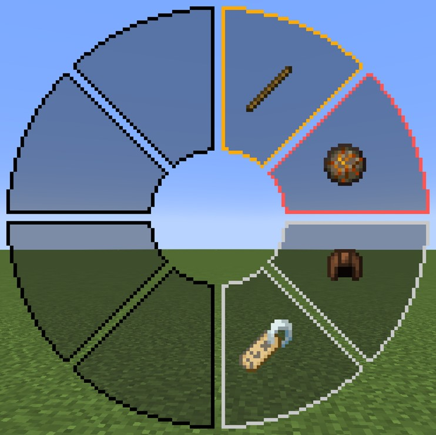

# FireWizard（炎の魔法使い）
MinecraftのスキンMod「[Figura](https://github.com/Moonlight-MC/Figura)」向けスキン「FireWizard（炎の魔法使い）」です。

## 特徴
- 魔法使いの帽子が追加されています。
  - 魔法使いのローブはスキンに含まれています。
  - 魔法の帽子は着脱可能です。
  - ヘルメットは帽子の先端に装飾として追加されます。

  

- 魔法の杖を装備出来ます。
  - 魔法の杖はメインハンドに装備されます。
  - 魔法の杖の装備中はメインハンドに持っているアイテムが描画されません（一人称のみ）。
  - 魔法の杖のオーブは暗い場所でも明るくなります。

  

- 魔法弾を撃てます。
  - 魔法弾はブロックの破壊やモブにダメージを与えません。あくまでも見た目だけの機能です。

  

- クリエイティブ飛行は魔法の箒にまたがって飛びます。
  - 魔法の箒の先端からはパーティクルが表示されます。

  

- プレイヤーが動くと髪がたなびきます。

## アクションバー
このスキンにはいくつかのアクションが用意されています。

### アクション1：魔法の杖の着脱
魔法の杖を着脱します。

### アクション2：炎の魔法
炎の魔法を撃ちます。先に魔法の杖を装備して下さい。

### アクション3：魔法の帽子の着脱
魔法の帽子を着脱します。

## テクスチャ

1. バニラスキン
   - スリムモデルのみ対応です。
2. 前髪
3. 後ろ髪
4. 右足の下6ピクセル
   - 魔法の杖飛行時に使用します。
   - オーバーレイヤーはこの下にあります。
5. 左足の下6ピクセル
   - 魔法の杖飛行時に使用します。
   - オーバーレイヤーはこの下にあります。
6. 魔法の帽子
7. 魔法の杖
   - 柄は魔法の箒と使い回します。
8. 魔法の箒
   - 柄は魔法の杖と使い回します。
9. 柄
10. 炎の魔法の魔法の輪
11. 帽子に付けられる装飾の防具
    - 左から革、チェーンメイル、鉄、金、ダイヤモンド、ネザライト、亀の甲羅です。
12. 魔法の杖飛行時用レギンス、ブーツのテクスチャ
    - 上から革、チェーンメイル、鉄、金、ダイヤモンド、ネザライトです。更にそれぞれ上からレギンスの上6ピクセル、レギンスの下6ピクセル、ブーツの上6ピクセル、ブーツの下6ピクセルです。革の防具にはオーバーレイヤーがあります。